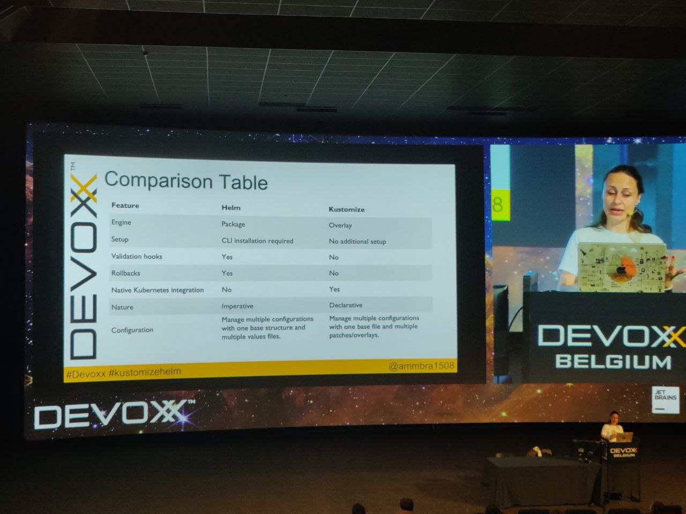

# Helm vs. Kustomize: the frenemies that soothe Kubernetes
#k8s #kustomize #helm

## Tools
- #Dekorate
- #Jkube

## Demo
Deploy #cassandra & #zipkins 
Kustomize can add commonLabels

Best pratices

keep custom ressources and instances  in separate packages

```bash
kubectl kustomize cfg fmt file_name
```

## Demo helm
Manage env with multiple values files
Avoid hardcoding
Always try dry install

## Demo helm+kustomize

Create yaml with helm then supercharge with kustomize
Kustomize build --enable-helm

helmChartInflationGenerator
- Override helm charts with kustomize

## Comparison table

[Github](https://github.com/ammbra/helm-vs-kustomize)

Personal note from the speaker : It's easier to generate then refine the files