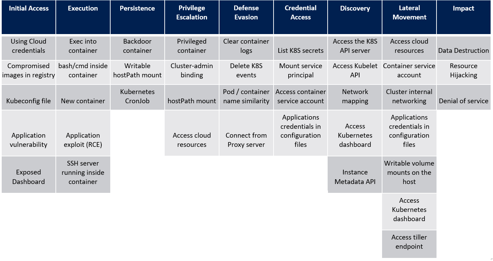

# How to secure a Kubernetes cluster from scratch?
#k8s #security #open-policy-agent

## Managing a Kubernetes Cluster
Attack vectors at multiple levels.
- App
- App runtime
- Base image
- Container runtime
- Kube cluster

Critical components to protect (etcd/kubelet/etc...)

Kube attack matrix by Microsoft

CIS Kubernetes Benchmark (heavy to read)

Detect config errors with #kube-bench
- Permissions on sensitive files
- Sensitive features enable etc...

Can be run in a container or installed on the master directly.

#Popeye : analyse ressources deployed on the cluster

Demo using #Krew manager plugin

#Kubehunter : pentest your cluster
- Can check from a external machine,
- On a cluster node
- From a pod

Focus on RBAC / Deployment control / Network policy

## RBAC :
 Users -> RoleBindings -> Roles -> Ressources -> Verbs
Demo

Limitations : Allow / Deny

### Control Deployments
With securityContext either at the pod level or container.
Only work at runtime.

### PodSecurityAdmission
Creation Time
Modes : 
- Enforce : Strict application
- Audit : Will log in the audit log
- Warn : Warning message after deployment
Levels :
- Privileged : No restriction
- Baseline : Host isolation / Privilege escaltion / limit capabilites 
- Restricted : run as non root

Can be defined at cluster level

**Analyse the impact of a policy with a dry run**

#### root user needed only when :
- Changes on host 
- Volumes access
- Dependencies
- Privileged ports
Check bitnami doc to build non root images

#### Distroless images
- Reduce surface attack
- Process isolation
- Protect secrets

## Network policies
Isolate pod / namespace between them.
Deny everything then allow what's necessecary 

Use a CNI that support Network Policies ( #Calico / #Cilium / #Kube-router...)

Enrich network policies with flexible def. (deny outbound traffic based on namespace / deny traffic on some ports depending on pods)

Some CNI offer L7 filtering (http methods & path)
- #istio RBAC
- CiliumNetworkPolicy

## Admission Controllers
Can plug own code with webhook
- Prefered solution : Open policy agent
	- Use Rego language
	- Policy as code
	- Declarative & context-based
	- Fine-grained governance
	- Agnostic and integrated with Kubernetes
	- Define policy in config maps in Rego
		- Input based policies
		- Context based policies
- Other solution own code

### Compliance pipeline :
- Kubeval : check if yml is well written
- Conftest : Fetch existing policies from the cluster at runtime to evaluate the new yml deployments
### Unit tests pipeline :
- opa debug image : use command test to run the unit tests
	- https://play.openpolicyagent.org

**Monitor OPA to make sure it doesn't run slow and slow down your network. (mandatory)**

Demo

Needs to learn Rego
Prefer the deployment with yml files rather than the OPA chart

**Impact third party deployments (Charts)**
**Conflict with cluster admission controllers (cloud)**
**Silent blocking of low lever kubernetes objects**

#### OPA security mecanims
- Authenfication & authorization on endpoints
- TLS encryption
- NetworkPolicy to inhibit incoming traffic

Main alternative : #Kyverno
Kube native
No rego just CRD

[Link](https://neonmirrors.net/post/2021-02/kubernetes-policy-comparison-opa-gatekeeper-vs-kyverno/)
## Threat detection
AuditD -> log every commands executed
Ossec / Wazuh -> Activities monitoring
Falco -> Activities monitoring in containers (container runtime analysis)

### Falco: 
Input : Sys input / events
Have : rules / macros

Listen to syscalls from containers either with kernel module (only if you own the machine) or e bpf probe

Can receive k8s audit / custom sources

Install falco on the host or deploy falco on the cluster as a deamonset

Rules : define a behavior for which an alert  should be trigerred
Macros : Reusable condition
Lists : set of reusable conditions

All can be defined on container / app level
A lot of rules already exists

Outputs : Broadcasting alerts -> #fluentd / traces / falco sidekick / mail

#Falco + #argo : deploy a sensor with argo. Falco calls the sensor that will create a network policy to block any traffic in the namespace. Then patch the pod to add the label of the network policy.

**Advanced usecase with opsgenie to escalate steps by steps**

#### Limitations :
- A lot of alerts are triggered with the default rules
- Error dropped events syscall
- Error if cluster > 400 nodes
- Follow up syscalls changes on kernel

#### Recommendations :
- Reduce the nb of elements to watch
- Start with a set of limited rules
- Structure pipeline to collect & store alerts from the beginning
- Reuse existing rules

## Scanning image vuln

### Tools : 
- #Clair (already installed in #gitlab / #harbor / #quay)
- #Aqua Trivy : have a CLI binary 

### Recommendations :
- Update vuln db everyday
- Rely on multiple scanner
- Build and share reliable images
- Inspect third-parties images (dive)
- Sign your images and restrict deploys in kube (notary project)

### Ressources : 
- Kubernetes security (book)
- Kubernetes hardening guidance NSA
- CIS Kubernetes Benchmark
- learnK8S