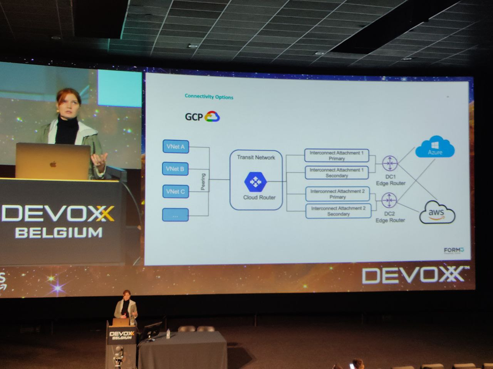

# Let’s Go Triple Active with Three Clouds and Cilium

#k8s #Cilium 

## Why do we need multi-cloud connectivity ?
- Reduce cloud outage
- High-availability
- Resiliency
- Scalability
- Performance
- Security

Cloud agnotic tech
kube / cilium / nats / cockroachdb

requirements (focused on one region)

low latency 5ms
steady bandwidth
fault tolerance with active-active POP (Point of precense)

connectivy options
VPN / Direct Connectivity via cloud exchange provider / Direct Connectivity via data center

vpn is pretty instable bc it relies on internet (8/12 ms but can go as high as 100ms and unpredictable routing)

They tried DC via CEP but megaport ha second route was using francfort that added too much latency.

They used DC via DC.

Kube network model

## Cilium
Operate in L3/4 and L7
	Use eBPF
Load balancing
Security
Network connectivity
Does network through the linux kernel instead of iptables

Cilium multi cluster = cilium cluster mesh

### Features
- Service discovery & load balancing
- Network policies
	- Identity based
	- Multi cluster
	- L3/L4, L7
- Encryption
	- IPSec & Wireguard
- Pod IP routing
	- Tunneling & direct routing

Cluster mesh config
Each cluster domain name must be resolvable to an ip address

AWS load balancing are DNS based : to fix that they patched cilium agent added to local /etc/hosts

## Lessons Learned
cilium-cli doesn't work on aws bc of hostname based load balancers
Open Source docs better than enterprise version
Need to learn how to clean properly existing CNI
- Need to taint until cilium is ready
API Server
Loadbalancer
DNS-Based for aws
IP based for Azure/GCP

Static IP addresses and host aliases

GCP/Azure : simple
AWS : more complex and may have collisions (dedicated subnets / reserved pools)

External DNS -> cloud dns -> multi-cloud-dns

## Does Cilium deliver on it's promises ?

Similar perf than standard cloud CNI
eBPF doesn't work on cloud bc the cloud provider is using their own network
Encryption isn't done on a single node but between nodes.